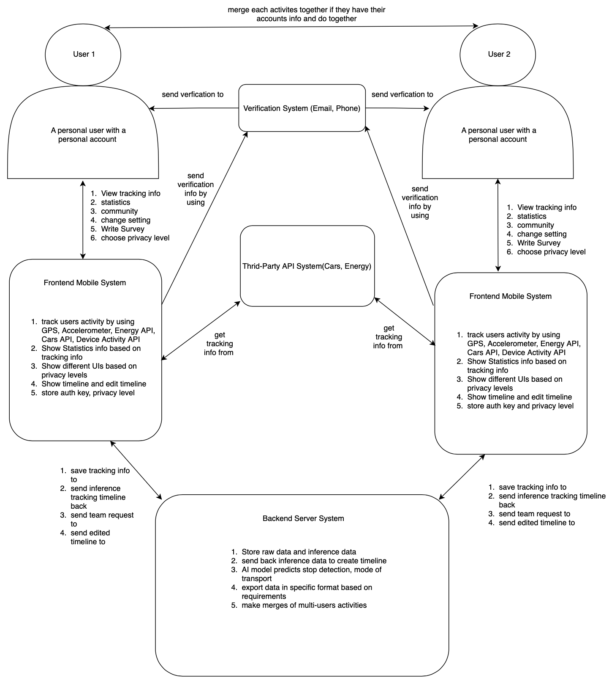
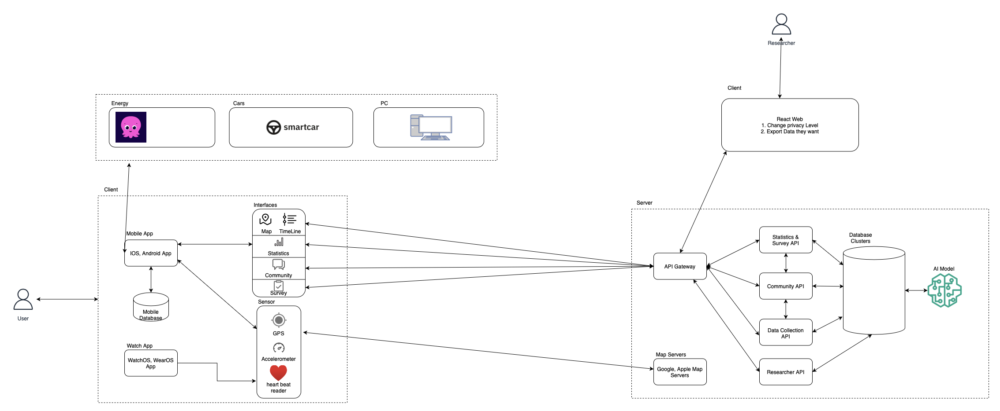
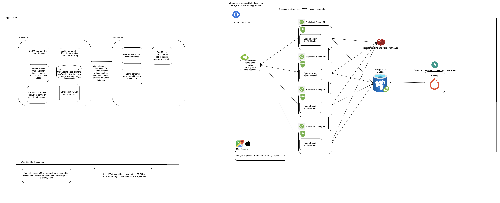

	<!
	<h1>I-MOTION</h1>
	

		<b>Application for building your own behavior and city behavior!</b>
	

	 
	 
	 

## Introduction
The I-MOTION Mobility, Social, Energy & Location Analytics application efficiently gathers raw sensor data from mobile devices, which is then sent to the IMOTION back-end system. 
Here, the data undergoes processing to construct partial journeys, which are composed of either solely tracks or tracks combined with stays. 
Tracks represent movements from one origin to a destination via a specific mode of transport, while stays represent periods of stationary activity, each with a distinct purpose.

This application serves a wide range of uses within the mobility sector. 
For instance, it provides detailed mobility data essential for transportation planning. 
By analyzing this data, planners can assess the usage of the transport network, evaluate the efficiency of existing infrastructure, manage passenger flows more effectively, and design innovative mobility services. 
Utilizing this application allows for the optimization of timetables and routes, expansion of transport services, and enhancement of passenger attraction efforts.

## Download

## Features

### Real-Time Motion Trail & Trip Timeline Prediction Demonstration

- I-MOTION can show users' trips and activites in the specific 
day.
- Users can choose to see any day of their trails by switching in the calendar.

### Background Sensors' Updating with No Sense

- When users don't use this application in the foreground, the application still record telephone's sensors(GPS, accelerometer, heart readers, etc.)

### Verification of Predictions

- Although this application will predict users' type of trips like modes of transport, users can still edit these predictions to make them as accurate as possible.

### Join Families & Friends

- Users can join their families in their activities and trips if families are connected by unique household ID.
- Users can also add others outside family by typing users' ID.

### Statistical Summary of Analysis

- Applications summarises variable aspects of users' trips weekly, monthly, yearly, such as:
 	- percentage of modes of transports
	- data usage
	- electrical & fuel usage at home or in cars

### Third-Party API Support

- Application integrates with APIs from partners, like Octpus Energy for electrical usage, SmartCar for fuel usage.

### Community Ranking for Good

- Show users' ranking of green trips with their near people or the whole nations.

## Frontend Design

## Backend Architecture

### Context Diagram

### Container Diagram

### Component Diagram

## Database Structure
## Test & Evaluation 
## Next Steps

## References

- Liang, Xiaoyuan, et al. "A deep learning model for transportation mode detection based on smartphone sensing data." IEEE Transactions on Intelligent Transportation Systems 21.12 (2019): 5223-5235.
- Xiao, Guangnian, Zhicai Juan, and Chunqin Zhang. "Detecting trip purposes from smartphone-based travel surveys with artificial neural networks and particle swarm optimization." Transportation Research Part C: Emerging Technologies 71 (2016): 447-463.
- Zhou, Yang, et al. "The smartphone-based person travel survey system: data collection, trip extraction, and travel mode detection." IEEE Transactions on Intelligent Transportation Systems 23.12 (2022): 23399-23407.
- Prelipcean, Adrian C., Győző Gidófalvi, and Yusak O. Susilo. "MEILI: A travel diary collection, annotation and automation system." Computers, Environment and Urban Systems 70 (2018): 24-34.
- Zhao, Fang, et al. "Stop detection in smartphone-based travel surveys." Transportation research procedia 11 (2015): 218-226.
- Hong, Shuyao, et al. "Insights on data quality from a large-scale application of smartphone-based travel survey technology in the Phoenix metropolitan area, Arizona, USA." Transportation Research Part A: Policy and Practice 154 (2021): 413-429.
- Alho, André, et al. "Online and in-person activity logging using a smartphone-based travel, activity, and time-use survey." Transportation Research Interdisciplinary Perspectives 13 (2022): 100524.

